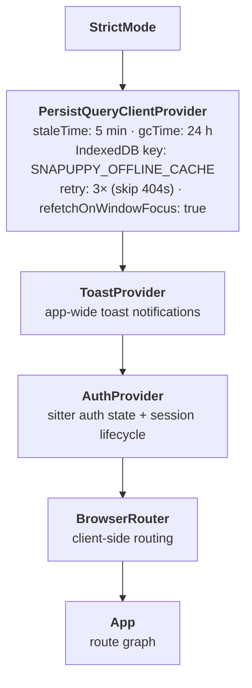
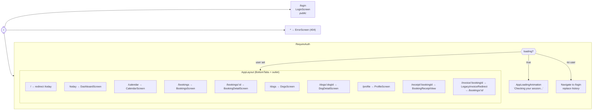
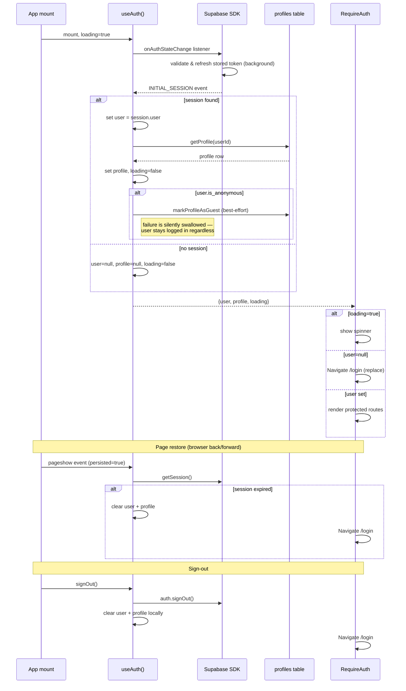
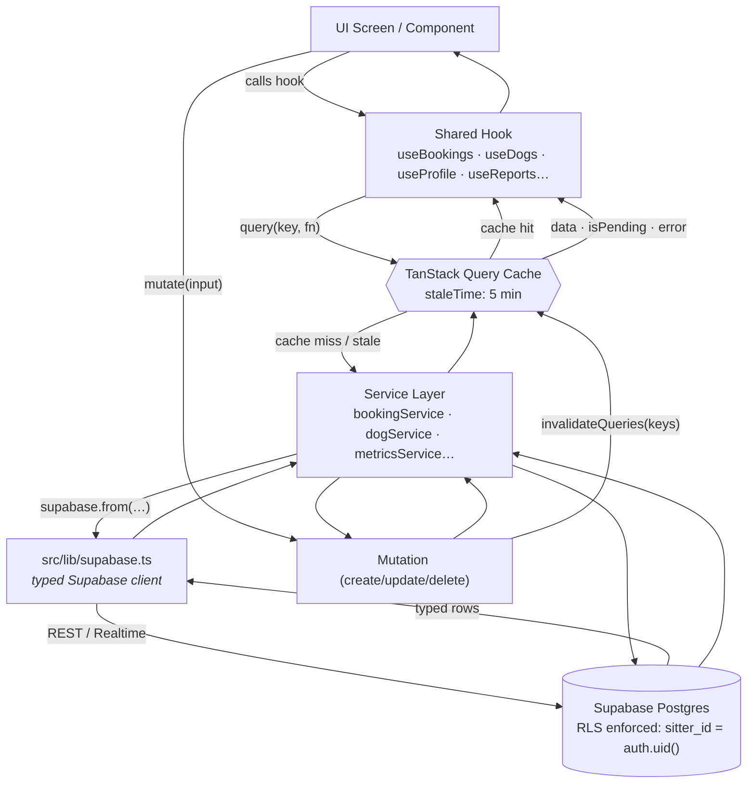
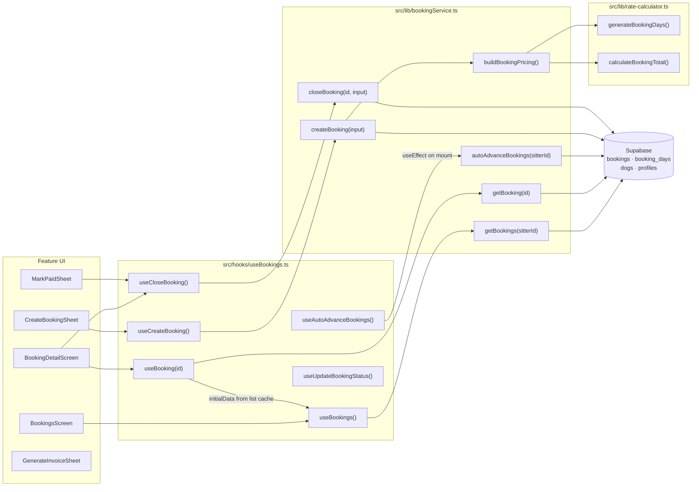
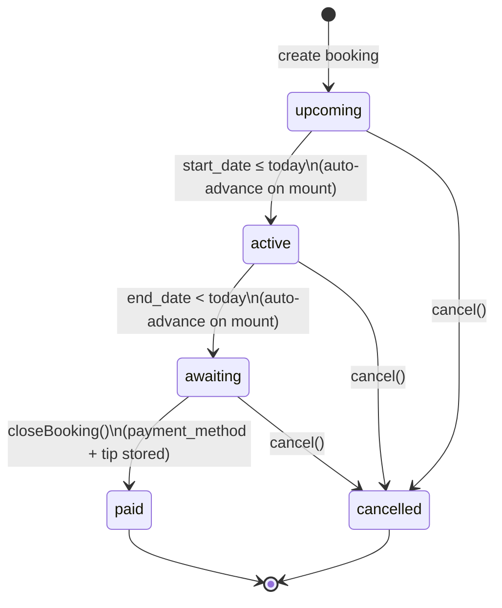
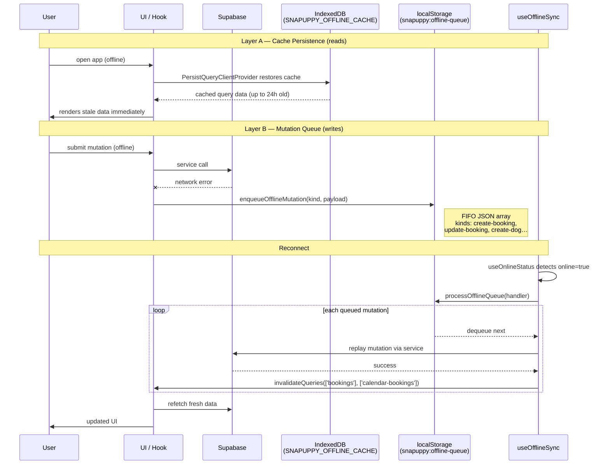
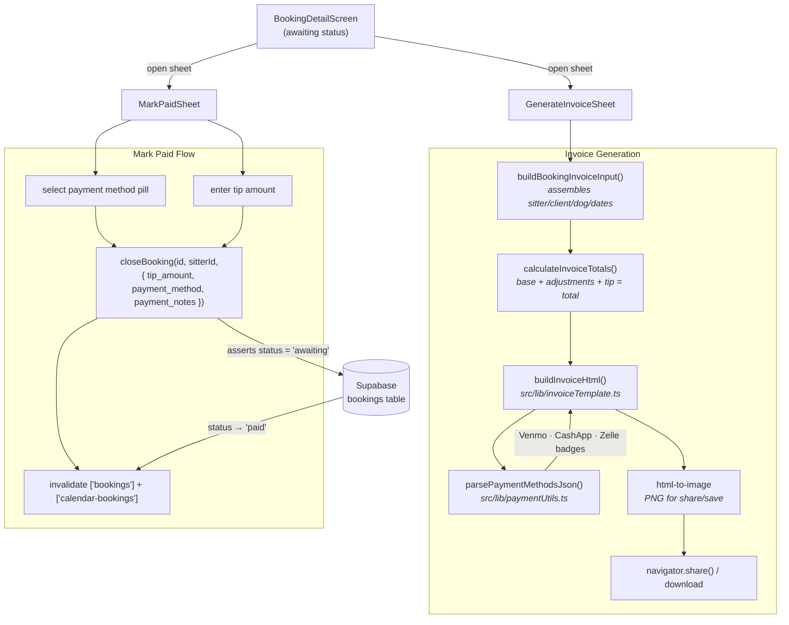
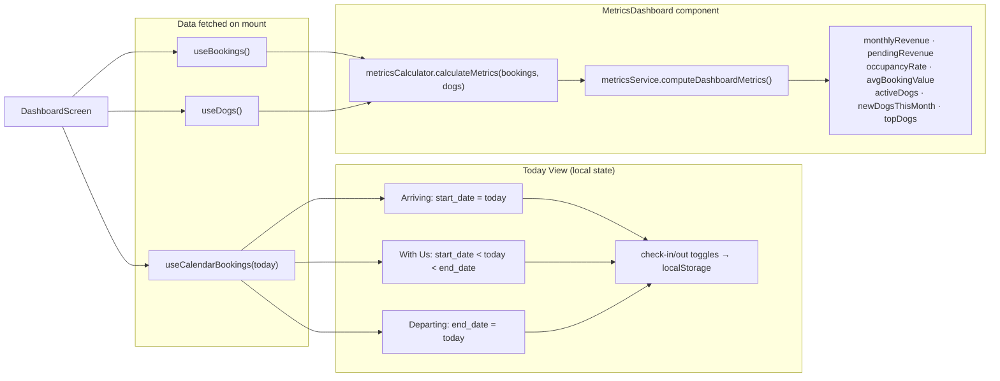
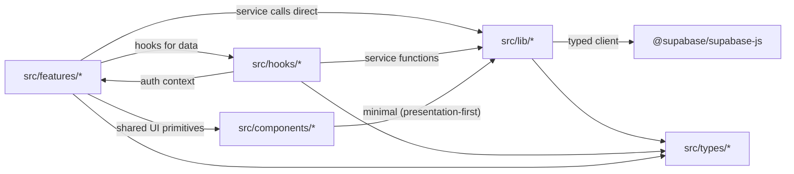

# snapuppy Architecture Reference

Phase 2+ SPA architecture — data flow, auth boundaries, offline behavior, query cache strategy, and module dependency rules.

---

## 1. App Bootstrap & Provider Tree

`src/main.tsx` mounts the root with a layered provider stack. Each layer adds a capability; inner layers depend on outer layers.

**Key startup behaviors:**
- Service worker is registered in production only; development unregisters all SWs to prevent stale cache.
- TanStack Query cache is restored from IndexedDB on mount — previously fetched data is available instantly before any network call.
- `refetchOnWindowFocus: true` refreshes data when the user returns to the tab (critical for mobile/PWA where the app is backgrounded frequently).

---

## 2. Route Graph & Auth Guard

`src/App.tsx` composes the full route tree. All protected routes are children of `RequireAuth`, which renders one of three states.

All screens inside `AppLayout` are **lazy-loaded** via `React.lazy()` with a shared `<Suspense>` boundary showing `LoadingFallback` ("Waking up the pack...").

---

## 3. Auth Lifecycle

`src/hooks/useAuth.ts` is the core auth state machine. `AuthProvider` wraps it in context; `RequireAuth` consumes it.

**Non-obvious behaviors:**
- `INITIAL_SESSION` is trusted without a server-side `getUser()` re-check — the SDK has already validated and rotated the token before firing this event.
- A `mounted` flag guards all async callbacks: if the component unmounts during `getProfile()`, the state setter is skipped.
- `user` is set *before* `profile` completes loading — brief window where `user !== null` but `profile === null`.

---

## 4. End-to-End Data Flow

The runtime data path: UI screen → hook → TanStack Query cache → service layer → Supabase.

**Service placement convention (tracked as tech debt):**
- Most services live in `src/lib/` (`bookingService`, `recurringService`, `metricsService`, etc.)
- Some feature-local services exist: `src/features/dogs/dogService.ts`, `src/features/profile/profileService.ts`, `src/features/guest/guestService.ts`

---

## 5. Booking Domain: Service → Hook → UI

**Pricing flow for `createBooking`:**
1. `buildBookingPricing(dateRange, profileRates, holidayDates)` in `bookingService.ts`
2. → `generateBookingDays()` in `rate-calculator.ts` → one row per night (boarding) or single row (daycare)
3. → `calculateBookingTotal()` sums row amounts
4. → booking insert + N `booking_days` inserts in a single transaction

**`useAutoAdvanceBookings` gotcha:** this is a `useEffect`, not a mutation — it fires on every mount of the bookings screen and silently promotes overdue bookings. It invalidates the `['bookings']` cache after completion.

---

## 6. Booking Status Lifecycle

**Status transitions:**
- `upcoming → active` and `active → awaiting` are **date-driven** — triggered by `useAutoAdvanceBookings` on `BookingsScreen` mount via `autoAdvanceBookings(sitterId)`.
- `awaiting → paid` is **user-driven** via `MarkPaidSheet` → `closeBooking()`, which asserts `.eq('status', 'awaiting')` — cannot close from other states.
- `cancelled` is terminal; UI hides cancelled bookings from lists by default.

---

## 7. Query Cache Strategy

All query keys are user-scoped to prevent cross-session cache pollution.

| Key pattern | Data | staleTime | Invalidated by |
|-------------|------|-----------|----------------|
| `['bookings', userId]` | All bookings + nested dogs + days | 5 min | Any booking mutation; dog update/delete |
| `['bookings', userId, id]` | Single booking (uses `initialData` from list) | 5 min | Booking status, days, invoice override mutations |
| `['calendar-bookings', userId, 'YYYY-MM']` | Month-scoped bookings (flat SQL, no nesting) | 5 min | Any booking mutation; uses `keepPreviousData` for smooth navigation |
| `['booking-options', userId]` | Dogs list + sitter profile (for create form) | 5 min | Dog CRUD; profile update |
| `['dogs', userId]` | All dogs | 5 min | Dog create/update/delete |
| `['dogs', userId, dogId]` | Single dog (uses `initialData` from list) | 5 min | Dog update/delete |
| `['profile', userId]` | Sitter profile + rates | 5 min | Profile update mutation |
| `['reports', userId]` | All report cards | 5 min | Report create/delete |

**Optimization patterns:**
- `initialData` on single-item queries: `useBooking(id)` and `useDog(dogId)` seed from the list cache — navigating to a detail screen shows data instantly.
- Calendar uses `keepPreviousData`: month navigation doesn't flash empty while the new month loads.
- Dog mutations broadly invalidate `['bookings']` and `['calendar-bookings']` because dog names are denormalized into booking records.
- Cache persists for 24 hours in IndexedDB — app reopens with full data before any network activity.

---

## 8. Offline Strategy

Two independent layers: query cache persistence (read path) and mutation queue (write path).

**Current coverage:** `create-booking` and `update-booking` kinds are handled. Other mutation kinds log a warning and are no-ops (extensibility points). Confirm per-mutation path before assuming offline safety.

---

## 9. Invoice & Payment Flow

**`parsePaymentMethodsJson` resilience:** handles HTML entity encoding, double/triple JSON stringify from production edge cases. Falls back to `null` (legacy free-text display) rather than throwing.

---

## 10. Dashboard Metrics Pipeline

**Notes:**
- Metrics are pure functions over the in-memory bookings/dogs arrays — no extra Supabase calls.
- Occupancy = booked nights ÷ 30 × 100. Filtered to current calendar month (`YYYY-MM` prefix).
- Today view check-in/out state persists to `localStorage` (separate keys from auth and offline queue) — it's operational state the sitter tracks during the day, not server state.
- `awaitingCount > 0` triggers an alert badge that navigates to `/bookings?tab=awaiting`.

---

## 11. Module Dependency Rules

Imports must flow in one direction. No cross-feature imports. No upward imports from `lib` into `features`.

**Enforced conventions:**
- Features may import from `hooks`, `lib`, `components`, `types` — never from another feature.
- `lib` is framework-agnostic where possible (pure functions, no React imports except specific service hooks).
- `components` has no feature-specific knowledge — all config comes via props.

**Known boundary friction (tracked in `docs/tech-debt.md`):**
- Service logic is split: `bookingService` + `metricsService` + `recurringService` in `src/lib`, but `dogService` and `profileService` are feature-local.

---

## 12. Feature Module Responsibilities

| Module | Responsibility |
|--------|---------------|
| `auth/` | Sitter authentication lifecycle — `LoginScreen`, `RequireAuth`, `AuthProvider`, `AuthContext` |
| `bookings/` | Booking lifecycle UI — create, edit, check-in/out, close, detail, mark-paid sheets |
| `calendar/` | Calendar surfaces — month/week view and date-scoped booking visualization |
| `dashboard/` | Today view (arriving/with-us/departing) + metrics dashboard widgets |
| `dogs/` | Dog CRUD — `DogsScreen`, `DogDetailScreen`, `AddDogSheet`, `dogService` |
| `guest/` | Guest-specific service logic (`guestService.ts`) — roadmap TBD |
| `invoice/` | Invoice preview, print/share pipeline, `BookingReceiptView` |
| `profile/` | Sitter profile, business rates, logo upload, `profileService` |
| `recurring/` | Recurring availability UI and recurrence occurrence generation |
| `reports/` | Daily report cards — list, sheet, card, detail modal |

---

## 13. State Management Model

State is layered by lifetime and scope. Use the narrowest scope that satisfies the requirement.

| Layer | Store | Examples | Scope |
|-------|-------|----------|-------|
| Server/cache | TanStack Query | bookings, dogs, profile | Session; persisted 24h to IndexedDB |
| Global context | React Context | auth user, toast queue | Session |
| Local component | `useState` / `useReducer` | form fields, sheet open/close, stepper step | Component lifetime |
| Browser-persisted | `localStorage` | offline queue, check-in/out toggles, session token | Cross-session |

---

## 14. Critical Entry Points

| File | Role |
|------|------|
| `src/main.tsx` | App bootstrap, provider tree, IndexedDB persistence, service worker |
| `src/App.tsx` | Route graph, auth guard composition, lazy boundaries |
| `src/lib/supabase.ts` | Typed Supabase client (`persistSession: true`, `storageKey: 'snapuppy-auth'`) |
| `src/hooks/useBookings.ts` | Representative hook — query keys, mutations, offline queue wiring |
| `src/lib/bookingService.ts` | Representative service — complex joins, pricing orchestration |
| `src/lib/rate-calculator.ts` | Pure pricing engine — generateBookingDays, calculateBookingTotal |
| `src/lib/offlineQueue.ts` | Mutation queue API — enqueue/dequeue/list/clear |
| `src/lib/sync.ts` | Queue drain orchestration — processOfflineQueue(handler) |
| `src/lib/invoiceTemplate.ts` | Invoice HTML renderer — delegates math to invoiceGenerator, payments to paymentUtils |

---

## 15. Practical Rules for Contributors

1. **New data fetching** → add a hook in `src/hooks/`, a service function in `src/lib/` (or feature-local if purely feature-owned). Mirror the `useBookings` query key + invalidation pattern.
2. **New mutations** → always invalidate affected query keys in `onSuccess`. Add `enqueueOfflineMutation` in `onError` for write operations that should survive offline.
3. **New routes** → add under `RequireAuth` in `App.tsx`; use `React.lazy()` for screens. Keep route paths in the established pattern (`/noun` or `/noun/:id`).
4. **Auth** → read from `useAuthContext()`. Never manage auth state directly in screen components.
5. **Styling** → use semantic classes from `src/styles.css` (`.surface-card`, `.btn-sage`, `.fab`, etc.) before reaching for raw Tailwind utilities.
6. **Types** → use `Tables<'table_name'>` and `TablesInsert<'table_name'>` from `src/types/index.ts`. Never use `any`.
7. **Service placement** → prefer `src/lib/` for cross-feature services; feature-local only if used exclusively by one feature. See `docs/tech-debt.md` for current known drift.
8. **Offline queue** → treat `OfflineMutationKind` as a contract. Adding a new kind requires a corresponding handler in `useOfflineSync.ts`.
